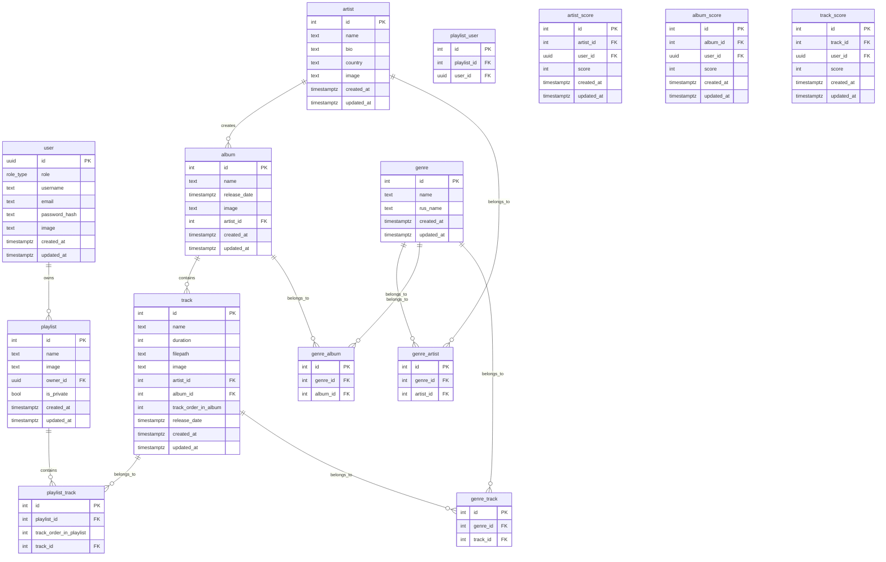

```mermaid
erDiagram
    user ||--o{ playlist : owns
    user {
        uuid id PK
        role_type role
        text username
        text email
        text password_hash
        text image
        timestamptz created_at
        timestamptz updated_at
    }

    artist ||--o{ album : creates
    artist ||--o{ genre_artist : belongs_to
    artist {
        int id PK
        text name
        text bio
        text country
        text image
        timestamptz created_at
        timestamptz updated_at
    }

    genre ||--o{ genre_artist : belongs_to
    genre ||--o{ genre_album : belongs_to
    genre ||--o{ genre_track : belongs_to
    genre {
        int id PK
        text name
        text rus_name
        timestamptz created_at
        timestamptz updated_at
    }

    album ||--o{ track : contains
    album ||--o{ genre_album : belongs_to
    album {
        int id PK
        text name
        timestamptz release_date
        text image
        int artist_id FK
        timestamptz created_at
        timestamptz updated_at
    }

    playlist ||--o{ playlist_track : contains
    playlist {
        int id PK
        text name
        text image
        uuid owner_id FK
        bool is_private
        timestamptz created_at
        timestamptz updated_at
    }

    track ||--o{ playlist_track : belongs_to
    track ||--o{ genre_track : belongs_to
    track {
        int id PK
        text name
        int duration
        text filepath
        text image
        int artist_id FK
        int album_id FK
        int track_order_in_album
        timestamptz release_date
        timestamptz created_at
        timestamptz updated_at
    }

    playlist_track {
        int id PK
        int playlist_id FK
        int track_order_in_playlist
        int track_id FK
    }

    genre_artist {
        int id PK
        int genre_id FK
        int artist_id FK
    }

    genre_album {
        int id PK
        int genre_id FK
        int album_id FK
    }

    genre_track {
        int id PK 
        int genre_id FK 
        int track_id FK 
    }

    playlist_user {
        int id PK
        int playlist_id FK
        uuid user_id FK
    }

    artist_score {
        int id PK
        int artist_id FK
        uuid user_id FK
        int score
        timestamptz created_at
        timestamptz updated_at
    }

    album_score {
        int id PK
        int album_id FK
        uuid user_id FK
        int score
        timestamptz created_at
        timestamptz updated_at
    }

    track_score {
        int id PK
        int track_id FK
        uuid user_id FK
        int score
        timestamptz created_at
        timestamptz updated_at
    }
```
